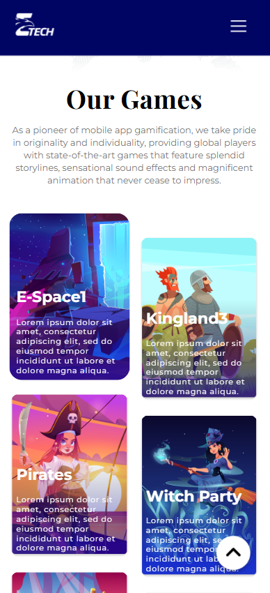

# nuxt-etech
- [Nuxt.js 3](https://nuxt.com/)
- Nuxt.js
- i18n
- SCSS


## 🚀 Tính năng
- Change Language (not done)
- ✅ Landing page Etech
## 🔧 Cài đặt

```bash
# Clone repository
git  https://github.dev/Mat1Lee/nuxt-etech/
cd ten-du-an

# Cài dependency
npm install

# Chạy dev server
npm run dev

#live site
https://chipper-pithivier-db61a9.netlify.app/

# Mô tả




